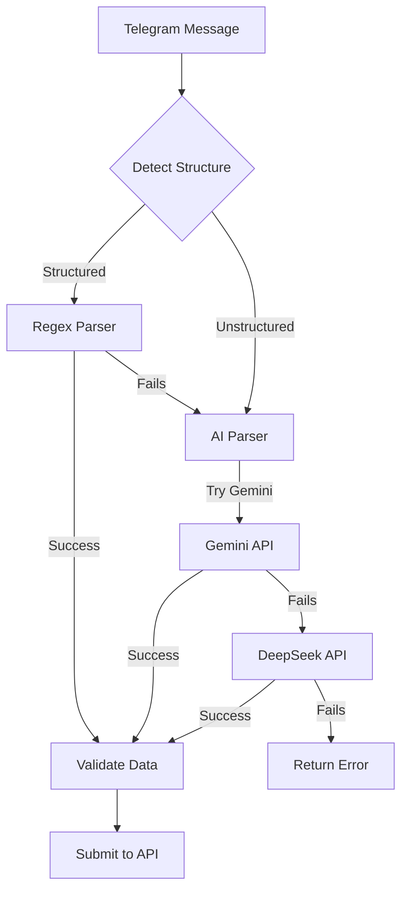

#AI-Powered Unstructured Data Parsing Integration

## Overview

Add AI-powered parsing using Google Gemini and DeepSeek APIs to handle unstructured donor data when the regex-based parser fails. The system will intelligently detect unstructured text and use AI to extract donor information.

## Architecture Flow




## Implementation Steps

### 1. Install Dependencies

- Add `@google/generative-ai` for Gemini API
- Add `axios` or use native `fetch` for DeepSeek API
- No additional dependencies needed for DeepSeek (uses standard HTTP)

### 2. Create AI Parser Service

**File: `lib/ai-parser.ts`**

- Create `parseWithGemini(text: string)` function
- Create `parseWithDeepSeek(text: string)` function
- Create `parseWithAI(text: string)` with fallback chain (Gemini → DeepSeek)
- Use structured prompts to extract donor data in JSON format
- Handle API errors gracefully

### 3. Create Unstructured Text Detector

**File: `lib/parser.ts` (update existing)**

- Add `isUnstructuredText(text: string)` function
- Detection logic:
- Check if text contains "Donor Name:" pattern (structured)
- Check if text mentions donor-related keywords but lacks structure
- Check if regex parser returns empty/invalid results
- Return boolean indicating if AI parsing should be attempted

### 4. Update Parser to Use AI Fallback

**File: `lib/parser.ts`**

- Modify `parseFormattedText` to accept optional `useAI` parameter
- Modify `parseBulkFormattedText` to:

1. Try regex parsing first
2. If fails or detects unstructured text, try AI parsing
3. Return parsed results from either method

- Maintain backward compatibility with existing structured format

### 5. Update Telegram Bot Processing

**File: `lib/telegram-bot.ts`**

- Update `processDonorMessage` to use AI parser as fallback
- Log when AI parsing is used (for monitoring)
- Handle AI parsing errors gracefully

### 6. Environment Variables

Add to `.env.local`:

- `GEMINI_API_KEY`: Google Gemini API key (optional, for free tier)
- `DEEPSEEK_API_KEY`: DeepSeek API key (optional, for free tier)
- `USE_AI_PARSING`: Enable/disable AI parsing (default: true)

### 7. AI Prompt Engineering

Create structured prompts that:

- Extract all donor fields (name, blood group, batch, hospital, phone, date, referrer, hall name)
- Handle various text formats (paragraphs, lists, mixed formats)
- Return JSON in expected format
- Handle missing fields gracefully
- Support multiple donors in one message

### 8. Error Handling

- Rate limiting: Handle API rate limits gracefully
- Timeout: Set reasonable timeouts for AI API calls
- Fallback: If both AI services fail, return helpful error message
- Logging: Log AI parsing attempts and results

### 9. Cost Optimization

- Only use AI when regex parsing fails
- Cache successful AI parsing patterns (optional)
- Use free tier limits efficiently

## Key Features

- **Smart Detection**: Automatically detects unstructured text
- **Dual AI Support**: Gemini and DeepSeek with automatic fallback
- **Backward Compatible**: Existing structured format still works
- **Error Resilient**: Graceful fallback if AI services fail
- **Cost Efficient**: Only uses AI when needed

## Files to Create/Modify

- `lib/ai-parser.ts` - AI parsing service (new)
- `lib/parser.ts` - Update with unstructured detection and AI fallback
- `lib/telegram-bot.ts` - Update to use AI parser
- `.env.local` - Add AI API keys (documentation only, not in code)

## AI Prompt Structure

```javascript
Extract donor information from the following text and return as JSON:
{
  "name": "string",
  "bloodGroup": "string (A+, A-, B+, B-, AB+, AB-, O+, O-)",
  "batch": "string or 'Unknown'",
  "hospital": "string or 'Unknown'",
  "phone": "string (Bangladesh format: 01XXXXXXXXX)",
  "date": "string (DD-MM-YYYY format)",
  "referrer": "string or empty",
  "hallName": "string or empty"
}

Text: [user message]
```


## Testing

- Test with various unstructured formats