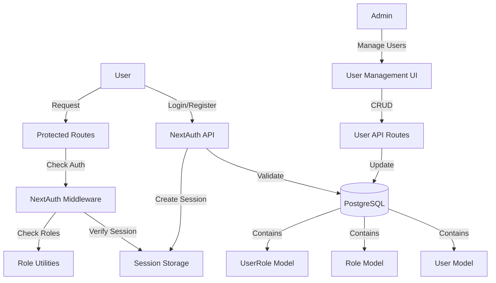

# Authentication System Implementation

## Overview

Implement a secure authentication system using NextAuth.js (Auth.js) with phone number and password authentication, role-based access control, and user management capabilities.

## Architecture




## Database Schema Changes

### New Prisma Models

- **User**: `id`, `phone` (unique), `password` (hashed), `name`, `createdAt`, `updatedAt`
- **Role**: `id`, `name` (unique: 'donor', 'moderator', 'admin'), `description`
- **UserRole**: `userId`, `roleId` (many-to-many relationship)

### Default Roles

- `donor` - Default role for all new users
- `moderator` - Can moderate content
- `admin` - Full access

## Implementation Steps

### 1. Install Dependencies

- Install `next-auth@beta` (v5 for Next.js 16+)
- Install `bcryptjs` and `@types/bcryptjs` for password hashing
- Update `package.json`

### 2. Database Schema Updates

- Update `prisma/schema.prisma`:
- Add `User` model with phone, hashed password, name
- Add `Role` model with name and description
- Add `UserRole` model for many-to-many relationship
- Add indexes for performance
- Create and run migration

### 3. NextAuth Configuration

- Create `app/api/auth/[...nextauth]/route.ts`:
- Configure Credentials provider for phone/password
- Set up session strategy (JWT recommended for serverless)
- Add callbacks for session and JWT to include user roles
- Create `lib/auth-config.ts` for NextAuth configuration
- Add environment variables: `NEXTAUTH_SECRET`, `NEXTAUTH_URL`

### 4. Authentication Utilities

- Update `lib/auth.ts`:
- Replace current localStorage-based auth
- Add password hashing utilities (bcrypt)
- Add role checking functions (`hasRole`, `isAdmin`, `isModerator`)
- Add middleware helpers for route protection

### 5. API Routes

- **Auth routes** (NextAuth handles these):
- `/api/auth/signin` - Login
- `/api/auth/signout` - Logout
- `/api/auth/session` - Get current session

- **User management routes**:
- `app/api/users/route.ts` - GET (list users), POST (register/create user)
- `app/api/users/[id]/route.ts` - GET, PUT, DELETE (admin only)
- `app/api/users/[id]/roles/route.ts` - Manage user roles (admin only)

### 6. UI Components

- **Login page**: `app/login/page.tsx`
- Phone number and password form
- Link to registration
- Error handling

- **Register page**: `app/register/page.tsx`
- Phone, password, name fields
- Password confirmation
- Auto-assigns 'donor' role

- **User management page** (admin only): `app/admin/users/page.tsx`
- List all users with roles
- Create/edit/delete users
- Assign/remove roles

### 7. Middleware & Route Protection

- Create `middleware.ts` at root:
- Protect admin routes (`/admin/*`)
- Protect training routes (`/training/*`)
- Allow public routes (search, submit)
- Redirect unauthenticated users to login

### 8. Update Existing Code

- Update all API routes to use NextAuth session:
- Replace `isAdminFromHeader` with proper session checks
- Add role-based authorization
- Update: `app/api/admin/check/route.ts`
- Update: `app/api/training/**/route.ts`
- Update: `app/api/donors/**/route.ts` (if needed)

- Update `app/layout.tsx`:
- Add SessionProvider wrapper
- Update Navigation to show user info/logout
- Update `components/Navigation.tsx`:
- Show logged-in user
- Show logout button
- Hide/show admin links based on role

### 9. Seed Initial Data

- Create seed script or migration to:
- Create default roles (donor, moderator, admin)
- Create initial admin user (if needed)

### 10. Environment Variables

Add to `.env.local`:

```javascript
NEXTAUTH_SECRET=<generate-secret>
NEXTAUTH_URL=http://localhost:3000
```


## Files to Create/Modify

### New Files

- `app/api/auth/[...nextauth]/route.ts` - NextAuth handler
- `lib/auth-config.ts` - NextAuth configuration
- `app/login/page.tsx` - Login page

- `app/register/page.tsx` - Registration page

- `app/admin/users/page.tsx` - User management (admin)
- `app/api/users/route.ts` - User CRUD API

- `app/api/users/[id]/route.ts` - User detail API
- `app/api/users/[id]/roles/route.ts` - Role management API

- `middleware.ts` - Route protection
- `prisma/seed-roles.ts` - Seed default roles

### Modified Files

- `prisma/schema.prisma` - Add User, Role, UserRole models

- `lib/auth.ts` - Replace with NextAuth utilities

- `app/layout.tsx` - Add SessionProvider

- `components/Navigation.tsx` - Add auth UI
- `app/api/admin/check/route.ts` - Use NextAuth session

- `app/api/training/**/route.ts` - Use NextAuth session

- `package.json` - Add dependencies

## Security Considerations

- Passwords hashed with bcrypt (salt rounds: 10-12)
- Phone numbers validated and normalized
- Session tokens stored securely

- CSRF protection (NextAuth handles this)
- Rate limiting on login/register endpoints (consider adding)
- Role checks on both client and server side

## Migration Strategy

1. Add new models without breaking existing Donor model
2. Run migration in development first

3. Update auth gradually (start with new routes, then migrate existing)